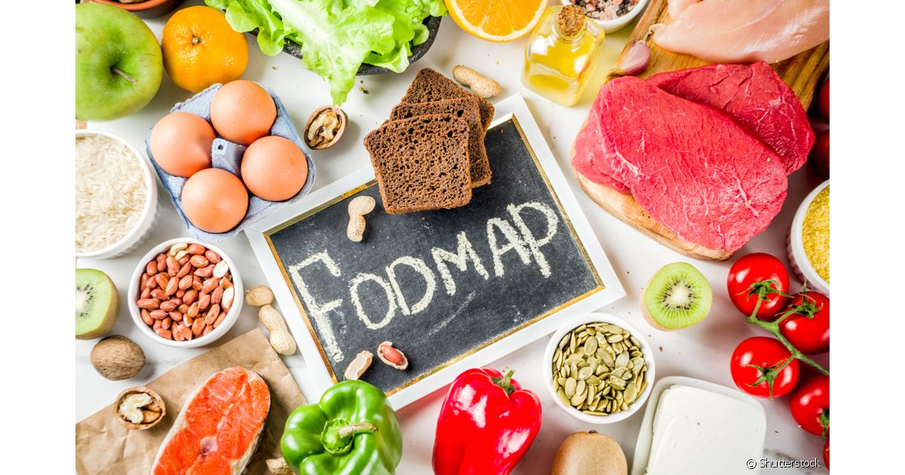

# API - LOW FODMAPs
## 🚀 Descrição


   >FODMAP é o conjunto de alimentos fermentáveis que são mal absorvidos pelo nosso organismo e que podem causar desconforto intestinal. Eles são classificados como oligossacarídeos, dissacarídeos, monossacarídeos e polióis. Os alimentos fermentáveis referidos são os carboidratos não digeridos pelo trato digestivo humano.<br>

   >
   >Para minizar sintomas de pessoas que sofrem com a Síndrome do Instetino Irritável, criamos esta plataforma afim de facilitar a busca por estabelecimentos que possuem alimentos e pratos com Low FODMAP, evitando também a contaminação cruzada, uma vez que é muito comum em restaurantes comuns ou linha de produçao de produtos.


# Sumário
=================
<!--ts-->
   * [Objetivos](#objetivos)
   * [Aprendizados](#aprendizados)
   * [Arquitetura Model View Controller](#arquitetura)
   * [Instalação](#instalação)
      * [Pre Requisitos](#pré-requisitos)
      * [Rodando o Back End](#rodando-o-back-end)
      * [Tecnologias](#tecnologias)
      * [Features](#features)
      * [Rotas](#rotas)
   * [Modelo com campos obrigatórios para teste: Postman ou Insomnia](#modelo-com-campos-obrigatórios-para-teste)
   * [Agradecimentos](#agradecimentos)
<!--te-->

## ✅Objetivos

- Cadastro de estabelecimentos pelos usuarios;
- Busca de estabelecimentos por nome, categoria bairro e delivery;
- Avaliação dos estabelecimentos atraves de like ou deslike e comentarios dos usuarios;
- Simplificar a busca de estabelecimentos que fornecem alimentos e refeições com Low FODMAPs;


## ✅Aprendizados

O projeto consiste em uma API fundamentada no CRUD, que são:  CREATE (CRIAR), READ(LER-CONSULTA), UPDATE(ATUALIZAR) e DELETE(DESTRUIÇÃO). 

## ✅Arquitetura

        Arquitetura MVC
        |
        \--📂  ESTABELECIMENTOS
            |   README.md  
            |   .gitignore
            |   package-lock.json
            |   package.json
            |   **server.js**
            \--📂 node_modules
            \--📂 assets
            \--📂src
                |
                |   **app.js**
                |
                |
                📂---controller
                |       
                |       estabelecimentosController.js
                |                      
                📂---model
                |       
                |       
                |       estabelecimentos.js
                |       
                |
                📂---routes
                |      
                |       estabelecimentoRoutes.js**
                |__      


## ✅Instalação
* Para realizar download do projeto, siga as instruções abaixo:

### 👩‍👧‍👦Pré-requisitos

Você precisa ter instalado em sua máquina as seguintes ferramentas:
[Git](https://git-scm.com), [Node.js](https://nodejs.org/en/) e o database NoSQL [Mongodb](https://www.mongodb.com/)
E editor de código como [VSCode](https://code.visualstudio.com/)

### 👩‍👧‍👦Rodando o Back End 

Server Local

```bash
# Com o git
# Clone este repositório
$ git clone <https://github.com/xeniabarreto/On14-TodasEmTech-s11-PG-II.git>

# Acesse a pasta do projeto no terminal/cmd
$ cd Estabelecimentos

# Instale as dependências
$ npm install

# Execute o servidor
$ npm start

# O servidor inciará na porta:777 - acesse <http://localhost:7777>

```

* Utilize o [Postman](https://www.postman.com/) ou [Insomnia](https://insomnia.rest/download/) para para chamar e testar os endpoints da API localmente ou via Heroku

## 🛠Tecnologias

Para a consturição do projeto, as seguintes tecnologiasforam utilizadas:

- [JavaScript](https://www.javascript.com/)
- [Git/Github](https://github.com/)
- [Node.js](https://nodejs.org/en/)
- [Nodemon](https://nodemon.io/)
- [Express](https://expressjs.com/pt-br/)
- [cors](https://www.npmjs.com/package/cors)

### 👩‍👧‍👦Features

Funcionalidades da aplicação

- [x] Cadastros do estabelecimento - POST
- [x] Comentario - POST
- [x] Like ou deslike - POST
- [x] Busca - GET
- [x] Busca por nome, categoria bairro e delivery - GET
- [x] Atualização em todos os campos - PATCH
- [x] Apagar - DELETE

### 👩‍👧‍👦Rotas

* local: http://localhost:7777


#### Retorna teste com apresentação 
{ mensagem: O app está rodando em http://localhost:7777 }
- [x] "/estabelecimentos" 

#### Cria novo cadastro de estabelecimento
- [x] "/estabelecimentos" 

#### Retorna estabelecimento por um id específico
- [x] "/:Id" 

#### Deleta cadastro do estabelecimento
- [x] "/estabelecimentos/[ID]" 


#### Dar um like em um estabelecimento
- [x] "/estabelecimentos/[ID]/like" 

#### Atualiza o cadastro de um estabelecimento (id não pode ser modificado)
- [x] "/estabelecimento/[ID]"


## ✅Modelo com campos obrigatórios para teste

### 👩‍👧‍👦 Estabelecimentos

{<br>
    "likes": 1,<br>
    "deslikes": 1,<br>
    "avaliacoes": "",<br>
    "nome": "Sorveteria Soroko",<br>
    "categoria": "Sorveteria",<br>
    "endereco": "Rua Augusta",<br>
    "numero": 305,<br>
    "bairro": "Consolação",<br>
    "cidade": "São Paulo",<br>
    "cep": "01305-000",<br>
    "telefone": "11 3258-8939",<br>
    "pagamento": ["dinheiro, cartao","pix"],<br>
    "delivery": false<br>
}


# Agradecimentos

<p align="justify">Tenho 31 anos, residente em São Paulo, capital. No momento me dedicando apenas aos estudos de programação. Trabalhar na área de tecnologia era sonho antigo, pois sempre desejei trabalho home office para ficar mais perto da minha mãe. Mas a vida é uma caixinha de surpresas, e assim como essa mudança na minha vida teve um start junto com a pandemia da Covid-19, infelizmente perdi minha amada mãe vítima da mesma circustância, ainda é duro saber que tenho tempo em casa e ela não está, e nem estará uma vez realizado a minha transição de carreira.

<p align="justify">Hoje, minha maior motivação é o Reprograma, onde tenho forças para seguir adiante, enquanto tudo ainda dói e ainda é recente. Por essas circustancias e muitas outras acarretadas pela ansiedade, também faço parte do grupo de pessoas que desenvolveram a Síndrome do Intestino Irritavel, uma doença sem cura e que não tratada nos afasta ainda mais do convivio social e da nossa felicidade.

<p align="justify">O cuidado agora é ainda mais essencial, e parece que muito mais dificil de alcançar, o importante é ter fé sempre no dia seguinte, que a vida poderá ser melhor num novo dia.

Xênia Barreto
<br>
</p>
